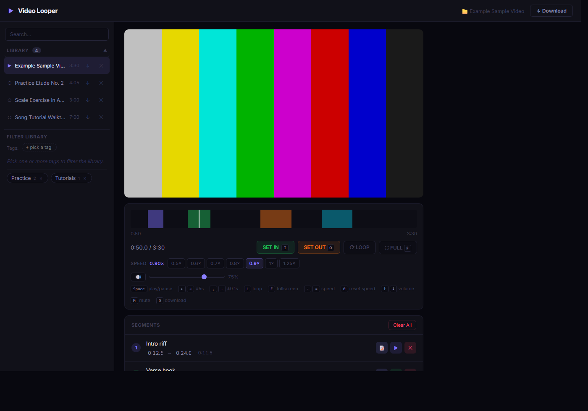

# Video Looper

A local-first, single-page app for downloading YouTube videos and drilling specific segments. Built for practice — pick a passage, loop it, slow it down, take notes, move on to the next.



> The library, tags, and segments above are example data for documentation — your local library lives in `data/` and is never committed.

## What it does

- **Download** — paste a YouTube URL, grab the video locally via `yt-dlp`.
- **Library** — every downloaded video lives in a searchable sidebar, tagged however you like.
- **Segments** — mark in/out points on any video, label them, jump between them, loop one or the whole sequence.
- **Playback control** — per-session speed (0.25×–2×), volume with mute, keyboard-first navigation.
- **Notes** — per-video and per-segment text notes that persist alongside the library.
- **Filters & collections** — narrow the library by tag; save tag combinations as named collections.

Everything is stored on disk as plain JSON — no database, no auth, no cloud.

## Setup

```bash
npm install
npm start
```

Open [http://localhost:3000](http://localhost:3000). Stop with `npm stop`.

## Cookies (required for YouTube downloads)

YouTube requires authentication. Export a `cookies.txt` from your browser using the [Get cookies.txt LOCALLY](https://chromewebstore.google.com/detail/get-cookiestxt-locally/cclelndahbckbenkjhflpdbgdldlbecc) extension while logged in, then drop the file onto the cookies bar in the download drawer.

## Usage

1. Open the **Download** drawer (top right or press `D`), paste a YouTube URL, click **LOAD**.
2. Pick a video from the **Library** in the sidebar.
3. Press `I` / `O` (or use **SET IN** / **SET OUT**) to mark a segment.
4. Add more segments as needed, then press `L` or click **LOOP** to play them in sequence.
5. Tune speed, volume, and notes as you work. Everything auto-saves.

## Keyboard shortcuts

| Key | Action |
|-----|--------|
| `I` / `[` | Set in point |
| `O` / `]` | Set out point |
| `Space` | Play / pause |
| `←` / `→` | Seek ±5s |
| `,` / `.` | Seek ±0.1s |
| `L` | Toggle loop |
| `F` | Toggle fullscreen |
| `-` / `=` | Speed ±0.05× |
| `0` | Reset speed to 1× |
| `↑` / `↓` | Volume ±5% |
| `M` | Mute / unmute |
| `D` | Toggle download drawer |

Shortcuts are suppressed while typing in an input or textarea, so you can take notes freely.

## Data layout

All state lives under `data/` (gitignored):

- `library.json` — one entry per downloaded video (id, title, file, duration, tags, notes).
- `segments.json` — keyed by video id; list of `{ start, end, color, label?, notes? }`.
- `collections.json` — named tag-filter presets.
- `cookies.txt` — your YouTube cookies (only if you uploaded them).

Downloaded video files live in `public/videos/` (also gitignored).

## Architecture

Three static files under `public/`:

- `index.html` — markup
- `styles.css` — all styles
- `app.js` — all client JS, loaded as one classic script

Server is Express 5 + `youtube-dl-exec`. See [CLAUDE.md](CLAUDE.md) for the working rules when extending it.
